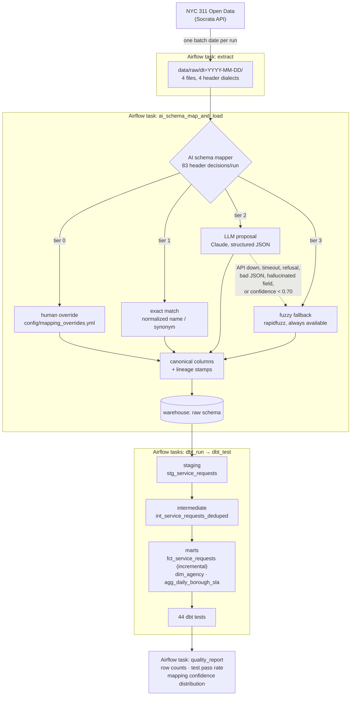

# nyc311-ai-etl

[](https://github.com/Sarvesh2k03/nyc311-ai-etl/actions/workflows/ci.yml)

**[▶ Live demo](https://nyc311-ai-etl.streamlit.app)** — press one button and the pipeline runs on complaints filed in NYC in the last few hours.

An AI-augmented, incremental batch ELT pipeline: **NYC 311 Open Data → AI-assisted schema mapping → cloud data warehouse → dbt → analytics marts**, orchestrated on a schedule by **Apache Airflow**.

The pipeline ingests real NYC 311 service requests arriving from four upstream "source systems" that each name their columns differently, resolves every incoming header to a canonical schema (LLM-assisted, with a deterministic fallback), lands the result in a warehouse, and builds tested dbt models on top.

**Measured on a real 14-day run: 133,993 rows, 44 dbt tests at a 97.7% pass rate, 83 schema-mapping decisions per run at 100% precision and 0 mis-mapped columns.** Full numbers in [Results](#results).

> **[▶ Open the dashboard](#dashboard)** — press one button and the whole pipeline runs in front of you: it pulls the newest complaints from the live NYC 311 feed, resolves every column header, loads them and runs all 44 dbt tests, in about four seconds. Nothing is pre-computed.

---

## Architecture



**Warehouse:** DuckDB locally (zero setup) or **BigQuery sandbox** (free, no credit card). One env var switches the Python loader *and* the dbt target together, so they can never disagree. Both are laid out as `raw` → `staging` → `analytics`.

### Why "ELT" and not "ETL"

Both terms describe moving data from a source into a warehouse; the difference is
*where the transformation happens*. Here, the only work done before loading is
schema mapping — renaming columns to the canonical contract and stamping
lineage. Everything that actually transforms the data — type casting,
deduplication, business logic, the fact table and the marts — runs **inside the
warehouse, after loading**, in dbt. That ordering is what makes this ELT, and it
is the pattern the modern stack (dbt + a cloud warehouse) is built around.

The distinction is worth being precise about in an interview: the pipeline is
ELT *because* dbt does the heavy transformation in-warehouse, which is also why
the warehouse is layered `raw` → `staging` → `analytics` rather than having
clean data arrive pre-shaped.

---

## The AI component: schema mapping

### The problem

The same 311 payload arrives from four upstream systems that each name their columns differently:

| Canonical field | `legacy_crm` | `vendor_csv` | `mobile_app_v2` | `partner_api` |
| --- | --- | --- | --- | --- |
| `request_id` | `SR_NUMBER` | `Service Request ID` | `srId` | `request_id` |
| `complaint_type` | `CMPLNT_TYP` | `Issue Category` | `reportCategory` | `complaint_type` |
| `intake_channel` | `INTK_SRC` | `Submission Method` | `originChannel` | `intake_channel` |
| `resolution_updated_at` | `DT_RES_UPD` | `Last Update Of Outcome` | `outcomeUpdatedAt` | `resolution_updated_at` |

Each file also carries operational columns (`ROW_CHECKSUM`, `Vendor Batch Ref`, `appVersion`, `etl_partition_key`) that map to **nothing**. Mapping one of those into a real field is worse than leaving it out, so declining is the correct answer.

> **On the data:** the rows are genuine NYC 311 Open Data. The four *header dialects* are synthesized in [`pipeline/source_dialects.py`](pipeline/source_dialects.py) to simulate multi-source ingestion — that file also records the ground-truth mapping, which is what makes mapping accuracy measurable rather than a matter of opinion.

### Four tiers, cheapest first

Implemented in [`pipeline/ai_schema_mapper.py`](pipeline/ai_schema_mapper.py). A column is resolved by the first tier willing to commit to it, and **every decision is logged with the tier that made it**.

| Tier | Method | When it runs | Cost |
| --- | --- | --- | --- |
| 0 | `override` | A human recorded this mapping after a previous run couldn't resolve it | free |
| 1 | `exact` | Normalized name equals a canonical name or declared synonym | free |
| 2 | `llm` | One Claude call for *all* remaining columns, with sample values | 1 call per source system per run |
| 3 | `fuzzy` | The fallback — whenever tier 2 is unavailable or unconvincing | free |

Anything no tier commits to is left `unmapped` and dropped at load time.

### Fallback behaviour — the part that matters

The LLM tier is treated as an **optimization, not a dependency**. The fuzzy fallback takes over when the LLM:

- is disabled (`AI_MAPPER_ENABLED=false`) or has no API key configured
- raises any exception — network error, auth failure, timeout
- returns `stop_reason: "refusal"`
- returns malformed or unparseable JSON
- omits a column from its response
- proposes a **canonical field that does not exist** (hallucination — validated against the schema and rejected)
- returns a proposal below `LLM_MIN_CONFIDENCE` (default 0.70)

Every one of these paths has a unit test ([`tests/test_ai_schema_mapper.py`](tests/test_ai_schema_mapper.py)). **The reference run below was produced with no API key configured** — i.e. entirely on the fallback path, with the auth failure recorded in the run's quality report. The pipeline completed normally.

### Two guardrails that earn their place

**1. One canonical field per column.** If two columns claim the same field, the higher-confidence one wins and the other is demoted to `unmapped`. This is not theoretical: the fuzzy tier proposes `assignedAgencyLabel → agency_code` and `agencyOutcomeNotes → agency_code` at 0.90 confidence, and the collision guard is what stops those wrong values from landing in a real column.

**2. Required fields must resolve.** If `request_id`, `created_at`, `agency_code` or `complaint_type` ends up unmapped, the task **fails loudly** rather than loading a table with a missing key. This is how the two `complaint_type` gaps were found — the run failed, a human recorded the mapping in `config/mapping_overrides.yml`, and it has been applied automatically ever since.

### Why the LLM tier exists at all

The fuzzy scorer takes the **minimum** of `WRatio` and `token_set_ratio`, which reliably rejects operational columns — all 7 distractors score ≤ 0.69, well under the 0.82 floor. What it cannot do is separate *semantic* near-misses:

| Column | Best fuzzy candidate | Score | Correct? |
| --- | --- | --- | --- |
| `boroughName` | `borough` | 0.90 | ✅ |
| `assignedAgencyLabel` | `agency_code` | 0.90 | ❌ (should be `agency_name`) |
| `agencyOutcomeNotes` | `agency_code` | 0.90 | ❌ (should be `resolution_description`) |

**No threshold separates these**, because the difference is meaning, not spelling. That gap — 13 columns the fallback misses per run — is exactly what the LLM tier is for, and why the fallback is tuned for precision over recall: it declines rather than guesses.

### Enabling the LLM tier

```bash
export ANTHROPIC_API_KEY=sk-ant-...
make run BATCH_DATE=2024-01-15          # LLM tier active
.venv/bin/python scripts/mapping_accuracy.py --use-llm   # measure it against ground truth
```

Delete `config/mapping_overrides.yml` first to measure what the LLM resolves unaided.

---

## The Airflow DAG

[`dags/nyc311_ai_etl_dag.py`](dags/nyc311_ai_etl_dag.py) — `schedule="@daily"`, `max_active_runs=1`, `catchup=True` over a bounded window, so switching it on produces **14 real daily runs over 14 real days of 311 data** rather than one synthetic run.

| Task | Type | What it does | Retries |
| --- | --- | --- | --- |
| `extract` | Bash | Pulls one batch date from the Socrata API into `data/raw/dt=<date>/`, one file per source system | 4 (flakiest dependency) |
| `ai_schema_map_and_load` | Bash | Resolves each system's headers to the canonical schema, stamps lineage, loads into the `raw` schema | 2 |
| `dbt_run` | Bash | Builds staging → intermediate → marts | 2 |
| `dbt_test` | Bash | Runs the 44-test suite; its exit code is deliberately not fatal | 2 |
| `quality_report` | Python | Parses `run_results.json`, builds the report, **fails the run if any test failed or errored** | 2 |

**Why `dbt_test` doesn't fail the run directly:** a `warn`-severity test and a `fail`-severity test both make `dbt test` exit non-zero. Handing the decision to `quality_report` means warnings stay visible without blocking, while genuine failures still stop the pipeline — and the report gets written either way, which is when you most want it.

**Retries and alerting:** exponential backoff (2 min → 10 min cap), 30-minute task timeout, and an `on_failure_callback` that emits a structured JSON alert and appends it to `reports/alerts.jsonl`. Swapping in Slack/PagerDuty/SMTP is a change to that one function; the SMTP path is a two-line uncomment in `default_args`.

**Idempotency.** Every task is safe to retry. The loader deletes a batch date's rows before inserting them, and `fct_service_requests` is incremental with `delete+insert` on `request_id`, so a re-landed request updates in place instead of duplicating. Verified by unit test and by re-running batch `2024-01-20` through Airflow after the backfill — row counts were unchanged.

---

## dbt models and tests

Five models across three layers ([`dbt/nyc311/`](dbt/nyc311/)):

| Layer | Model | Materialization | Purpose |
| --- | --- | --- | --- |
| staging | `stg_service_requests` | view | Type-casts and trims. One row in, one row out — a faithful typed mirror, so any row loss downstream is attributable |
| intermediate | `int_service_requests_deduped` | view | One row per `request_id`, newest ingest wins |
| marts | `fct_service_requests` | **incremental** | Request grain, `delete+insert` on `request_id` |
| marts | `dim_agency` | table | Agency dimension; most frequent spelling per acronym |
| marts | `agg_daily_borough_sla` | table | Analytics-ready: volume, closure rate, resolution-time stats by day/borough/agency |

**44 tests**, all documented with column-level descriptions (`dbt docs generate` builds the full catalog):

| Type | Count | Examples |
| --- | ---: | --- |
| `not_null` | 24 | keys, timestamps, grain columns |
| `within_range` | 5 | **custom** — lat/lon inside NYC, rates in [0,1], no negative durations |
| `not_in_future` | 4 | **custom** — timestamps can't be in the future (with a clock-skew grace) |
| `accepted_values` | 4 | boroughs, statuses, source systems |
| `unique` | 2 | `fct.request_id`, `dim_agency.agency_code` |
| `relationships` | 2 | fact → `dim_agency`, mart → `dim_agency` |
| singular | 3 | closed-before-created invariant, aggregate row-count reconciliation, anomaly-rate observability |

The two custom generic tests do double duty: `not_in_future` and the closed-before-created invariant are exactly what a **swapped `created_at`/`closed_at` mapping** would trip, so they guard the AI mapper as well as the source data.

### A real data-quality finding

The `assert_closed_after_created` test failed on the first full run: **17 requests (all DOT) are stamped closed exactly 72 hours *before* they were created** — upstream backdating in the real 311 feed.

Rather than drop the rows (they are real service requests and still count as volume) or let them through (six negative durations would quietly drag down every SLA average), `fct_service_requests` **flags them with `has_invalid_timestamps` and nulls `resolution_hours`**. The strict test now asserts every anomaly is flagged *and* quarantined; a separate `warn`-severity test keeps the rate visible on every run without blocking the pipeline. That warning is the single non-passing test in the results below — it is doing its job.

---

## Results

Reference run: 14 consecutive daily batches, **2024-01-08 → 2024-01-21**, DuckDB target, **LLM tier inactive (no API key) — fallback path only**. Reproduce with `make backfill`.

### Volume and runtime

| Metric | Value |
| --- | ---: |
| Rows loaded | **133,993** |
| Daily batches | 14 |
| Source files ingested | 56 (4 systems × 14 days) |
| Rows at landing → staging → deduped → fact | 133,993 → 133,993 → 133,993 → 133,993 |
| `agg_daily_borough_sla` rows | 854 |
| `dim_agency` rows | 14 |
| Full 14-batch backfill wall time | **127 s** (≈9.1 s per batch) |
| Single batch via Airflow (5 tasks) | **8 s** |
| dbt run + test per batch | ~0.6 s |

### dbt tests

| Metric | Value |
| --- | ---: |
| Tests | **44** |
| Passed | **43 (97.7%)** |
| Failed / errored | **0** |
| Warned | 1 (timestamp-anomaly observability test) |
| Timestamp anomalies quarantined | 17 of 133,993 (0.013%) |

### AI schema mapping

Per run: **83 header decisions** across 4 source systems. Across the 15 logged runs: **1,245 decisions** in `reports/mapping_decisions.jsonl`.

| Metric | Value |
| --- | ---: |
| Auto-match rate (excludes human overrides) | **75.0%** (60/80) |
| Recall — correct ÷ columns that should map | **82.9%** (63/76) |
| **Precision — correct ÷ columns mapped** | **100.0%** (63/63) |
| **Columns mis-mapped** | **0** |
| Operational columns correctly declined | **7 / 7** |
| Resolved by tier | `exact` 43 · `fuzzy` 17 · `override` 3 · `unmapped` 20 |
| Human overrides | 3 (recorded once, applied automatically since) |
| LLM auto-mapped | 0 — **no API key; every LLM call failed to auth and fell back as designed** |

> The 20 `unmapped` columns per run are 7 operational columns (correctly declined) plus 13 semantic near-misses the fallback refuses to guess at — the gap the LLM tier is built to close. Re-run with `ANTHROPIC_API_KEY` set to measure it.

Reproduce the accuracy numbers: `.venv/bin/python scripts/mapping_accuracy.py`

---

## Dashboard

```bash
make dashboard          # http://localhost:8501
```

Two pages. The landing page is a **working demo, not a description of one**.
The architecture and design rationale live on the second page, so nothing has to
be read before the thing can be used.

### Run it on live data — the button

The landing page's first control runs **the actual pipeline, on demand**:

1. calls the NYC 311 Open Data API for the newest service requests that exist
   right now — rows that did not exist last week,
2. splits them across the four upstream header dialects,
3. runs the real `pipeline/ai_schema_mapper.py` over those headers,
4. lands the resolved rows in a throwaway DuckDB database,
5. builds and tests **the real dbt project** on top of them.

A measured run: **1,500 live rows, 83 header decisions, 75% auto-matched, 5
models built, 44/44 dbt tests passed, 4.2 seconds end to end.** Every live run
gets its own temporary database, which is deleted when the run finishes — the
project's real warehouse is never touched.

Step 5 needs `duckdb` and `dbt`, which are optional. Where they are missing the
run falls back to the same assertions evaluated in pandas — each labelled with
the dbt test it corresponds to — and the page says which engine ran. That mirrors
the pipeline's own design: the expensive path is an optimization, never a
dependency.

| Page | What it is |
| --- | --- |
| **Demo** (landing) | The live-run button; a mapper playground where **any column name you type** is resolved or declined by the real code, with the candidates it ranked; then the reference run's mapping results, data quality and loaded data |
| **How it works** | Architecture diagram, the four-tier design and why it is built that way, the dbt layer, the canonical schema, and every command needed to reproduce the run |

**Two data sources, one interface.** The reference-run sections read a local
DuckDB warehouse when one exists, and otherwise fall back to Parquet snapshots of
a real 14-batch run committed under `data/demo/` (324 KB). The snapshot is
written by `scripts/export_demo_data.py` — it exports results, it never generates
them, so nothing on the page is invented. The live-run button needs neither: it
fetches its own data.

The live mapper demo runs the **real** `pipeline/ai_schema_mapper.py`. With no
API key the LLM tier is skipped and the deterministic fallback answers — which is
exactly what the pipeline does in production when the model is unreachable.

### Deploying it

`requirements.txt` at the repository root is deliberately the **light** one —
Streamlit, Altair, pandas, pyarrow, rapidfuzz, PyYAML. The ELT stack lives in
`requirements-pipeline.txt` and is never installed on a hosting platform. The
dashboard is verified to run in an environment with **no duckdb, dbt, anthropic
or airflow installed**, falling back to the committed snapshot.

```bash
# Streamlit Community Cloud: point it at this repo, main file app/streamlit_app.py
# Optional: set REPO_URL so the sidebar links back to the source.
```

---

## Setup

### 1. Local run (no Docker, ~2 minutes)

```bash
make setup                              # venv + dependencies
make backfill                           # 14 daily batches end to end
make report BATCH_DATE=2024-01-21       # print the quality report
make test                               # 40 tests (pipeline + dashboard + live run)
```

Run a single batch: `make run BATCH_DATE=2024-01-15`

### 2. Airflow via Docker Compose

```bash
make airflow-up                         # builds the image and starts the stack
# http://localhost:8080  (airflow / airflow)
make airflow-trigger                    # unpause; catchup runs the 14-day window
make airflow-logs
make airflow-down                       # stop and remove volumes
```

LocalExecutor with one Postgres metadata DB. Postgres is deliberately **not** published to the host, so it can't collide with a Postgres you already run on 5432. Only port 8080 is exposed.

Run one DAG execution without the scheduler:

```bash
docker compose -f docker/docker-compose.yaml exec airflow-scheduler \
  airflow dags test nyc311_ai_etl 2024-01-21
```

### 3. BigQuery sandbox (free, no credit card)

1. Create a project at [console.cloud.google.com](https://console.cloud.google.com) and open BigQuery — the sandbox activates automatically (tables expire after 60 days; no billing account needed).
2. Create a service account with **BigQuery Data Editor** + **BigQuery Job User**, download its JSON key to `secrets/bq-service-account.json`.
3. Configure and run:

```bash
cp .env.example .env        # set WAREHOUSE=bigquery, BQ_PROJECT, GOOGLE_APPLICATION_CREDENTIALS
.venv/bin/pip install dbt-bigquery google-cloud-bigquery pandas-gbq
set -a && source .env && set +a
make backfill
```

`WAREHOUSE` sets the dbt target too, so the loader and dbt always point at the same warehouse. The three dialect differences between DuckDB and BigQuery (`try_cast`/`safe_cast`, `date_diff`/`timestamp_diff`, `median`/`approx_quantiles`) are isolated in [`dbt/nyc311/macros/cross_db.sql`](dbt/nyc311/macros/cross_db.sql), so every model is written once and runs on both.

### 4. dbt docs

```bash
make dbt-docs                           # generates and serves on :8081
```

### 5. Continuous integration

`.github/workflows/ci.yml` runs the full test suite, `dbt parse`, and a real
one-batch build-and-test on every push, then uploads the resulting quality
report as a build artifact.

---

## Project layout

```
pipeline/                  # all business logic — runs with or without Airflow
  canonical_schema.py      #   the target contract: 19 fields + descriptions + synonyms
  source_dialects.py       #   the 4 upstream header dialects + ground truth
  extract.py               #   Socrata API → raw files, one batch date per run
  ai_schema_mapper.py      #   ★ the AI component: 4 tiers, guardrails, decision log
  transform.py             #   apply the column map, stamp lineage
  load.py                  #   DuckDB / BigQuery behind one interface
  ingest.py                #   map + transform + load for a whole batch
  quality_report.py        #   row counts, dbt results, confidence distribution
  cli.py                   #   the entry points every Airflow task wraps
dags/nyc311_ai_etl_dag.py  # orchestration only — no business logic
dbt/nyc311/                # 5 models, 44 tests, 2 custom generic tests, 5 macros
config/mapping_overrides.yml  # human-in-the-loop mappings
tests/                     # 40 tests: AI failure paths, idempotency, dashboard, live run
app/                       # the dashboard
  streamlit_app.py         #   landing page: live pipeline run + mapper demo
  live_run.py              #   fetches live 311 data and runs the real pipeline on it
  pages/1_How_it_works.py  #   architecture and design rationale
  charts.py, diagram.py    #   validated palette, hand-built architecture SVG
  style.py, data_access.py #   shared styling; live-warehouse-or-snapshot loading
data/demo/                 # committed snapshot of a real run, so the dashboard runs anywhere
scripts/                   # backfill.sh, mapping_accuracy.py, export_demo_data.py
.github/workflows/ci.yml   # tests + dbt parse + a real one-batch build on every push
reports/                   # quality reports + the mapping decision audit log
docker/                    # Dockerfile + docker-compose.yaml
```

**Design note:** every Airflow task is a thin wrapper over `python -m pipeline.cli <subcommand>`. The DAG holds scheduling, retries, alerting and dependencies; the pipeline holds the logic. That is why the whole thing can be run and tested on a laptop without Airflow — and why the unit tests can exercise LLM timeouts, refusals and hallucinations that would be impractical to trigger through a DAG.

## Known limitations

- The four source dialects are synthesized from one real dataset; a fifth genuinely unseen dialect would be a stronger test of the mapper's generalization (adding one is a single edit to `source_dialects.py`).
- The LLM tier's accuracy is unmeasured here — the reference run had no API key. Everything needed to measure it is in place (`scripts/mapping_accuracy.py --use-llm`).
- `dim_agency` is rebuilt in full on each run. At 14 rows that is free; at real dimension scale it would want an incremental or snapshot strategy.
- The mapper decides on headers and sample values only. It does not profile full column distributions, which would catch a same-name-different-meaning mapping that string and sample evidence miss.
